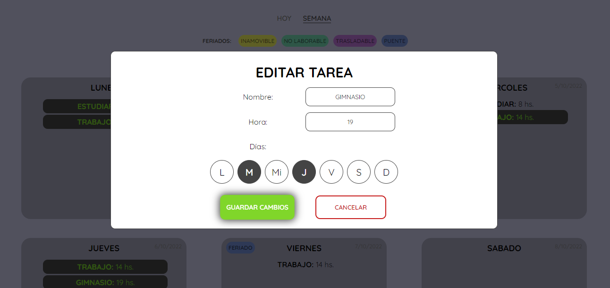

# AGENDA TU SEMANA
En la siguiente app podrás agendar tareas que tengas que realizar en la semana de una manera bastante intuitiva, solo ve a "AGREGAR TAREA" llena los campos y ya tendrás tu tarea.
Podrás marcar tus tareas como completas, editarlas y hasta eliminarlas.
  
LIMITACIONES:  
 - Guardará las tareas que hayas marcado como completas, pero cuando empiece una nueva semana seguirán así (no te preocupes, hay un boton al final de la pagina para desmarcarlas)  
 - Solo puede mostrar la semana actual y día de hoy, vive en el presente ☮  
  
[Demo de Agenda](https://valentinozucchellapaz.github.io/JavascriptEntrega1/)
  
¿Cómo usar?  
---  
  
#### Agrega tus tareas:  
  
  

#### Visualiza e interactua:  
  
  

#### Edita tus tareas:  
  
  
  
¿Cómo funciona?  
---  
Las tareas se guardan en un `array` llamado tasks y en `localStorage`. Cuando las tareas se manipulan o crean se suben a task, y task se sube al localStorage (siendo este una copia de tasks en todo momento), cuando se carga la página, tasks es la totalidad de tareas del localStorage.  
Cada tarea es un objeto javascript compuesto por los días de esa tarea (array), el nombre, la hora, el id (importante para la busqueda de tareas) y el array completed (los días en lo que se marcó como completa)  
Cada vez que se agrega una tarea, se hace un `tasks.push()` y se imprime en su día correspondiente, a la vez se 'actualiza' el storage (se borra todo y vuelve a subir tasks), todo por la misma funcion __createTask__. Se hace esto para que siempre se mantenga la igualdad de tasks y localStorage.  
Cuando se edita una tarea, esta se borra y se vuelve a subir nuevamente editada, funcionando similar a como se eliminan (se crea una nueva tarea sin el día que se quiere eliminar, se sube esta y se elimina la anterior), usando metodo `filter`.  
  
API  
---  
Se consume una [API de feriados](https://pjnovas.gitbooks.io/no-laborables/content/) usando `fetch` y el método `GET`, la API devuelve todos los feriados de Argentina, diferenciando `no laborables`, `trasladables`, `inamovibles`, `puentes`. Cuando se imprimen, se marca el día feriado mostrando el tipo (diferenciado por color) y (al hacer hover) el nombre del feriado. 
